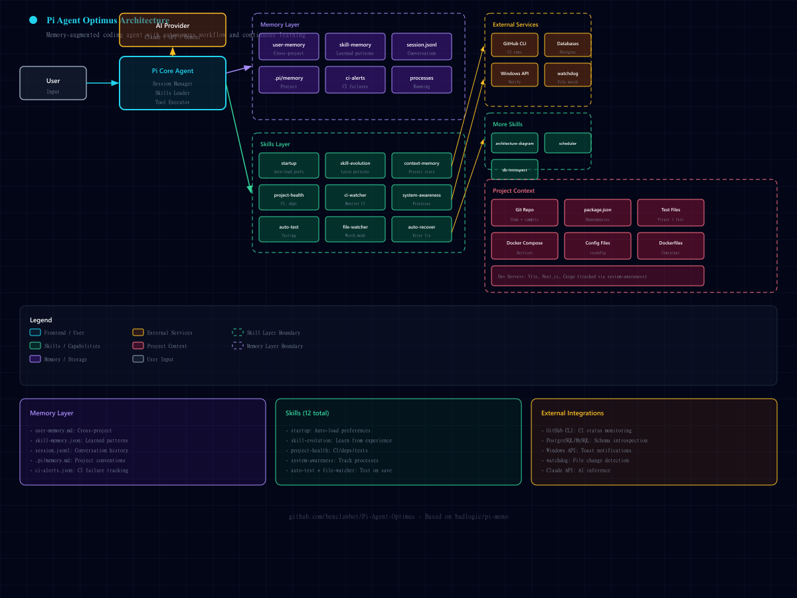

# Pi Agent Optimus



*A memory-augmented, production-ready coding agent with autonomous workflow and continuous learning.*

## What is Pi?

Pi is a terminal-based coding agent that uses AI to help you develop software. It reads files, executes commands, writes code, and manages your development workflow. You can read more about Pi in the [official documentation](https://github.com/badlogic/pi-mono).

## What is Pi Agent Optimus?

Pi Agent Optimus extends the base Pi installation with:

1. **Persistent Memory** - Cross-project preferences and session-crossing context
2. **Continuous Learning** - Skills that evolve based on experience
3. **System Awareness** - Knows about running servers, ports, and processes
4. **Automated Testing** - Runs tests on file changes
5. **Error Recovery** - Diagnoses and fixes common errors automatically
6. **Health Monitoring** - Tracks CI status, dependencies, and project health
7. **Architecture Diagrams** - Generates SVG architecture diagrams
8. **Database Introspection** - Queries schemas without running the app
9. **Scheduling** - Sets reminders and notifications
10. **CI Watching** - Monitors pipelines and alerts on failures

## Quick Start (One Command)

```bash
# Clone and run setup - that's it!
git clone https://github.com/benclawbot/Pi-Agent-Optimus.git ~/Pi-Agent-Optimus
cd ~/Pi-Agent-Optimus
./setup.sh
```

The setup script will:
1. Check and install Node.js if needed
2. Install Pi coding agent
3. Install all 12 enhanced skills
4. Configure your preferences
5. Install Python dependencies
6. Guide you through API key setup

## Manual Installation

If you prefer to install manually:

```bash
# 1. Install Node.js from https://nodejs.org

# 2. Install Pi
npm install -g @mariozechner/pi-coding-agent

# 3. Clone and copy files
git clone https://github.com/benclawbot/Pi-Agent-Optimus.git ~/Pi-Agent-Optimus
cp -r ~/Pi-Agent-Optimus/skills/* ~/.pi/agent/skills/
cp ~/Pi-Agent-Optimus/settings.json ~/.pi/agent/
cp ~/Pi-Agent-Optimus/user-memory.md ~/.pi/user-memory.md

# 4. Install Python dependencies (optional)
pip install watchdog psycopg2-binary pymysql
```

## Configuration

1. **Configure your AI provider** - Follow [Pi's provider setup](https://github.com/badlogic/pi-mono)

2. **Fill in your preferences** - Edit `~/.pi/user-memory.md`:

```markdown
## Communication Preferences
- **Response verbosity:** Concise
- **Format:** Context-dependent (bullets/tables/steps)
- **Tone:** Direct

## Work Style
- **Clarification first:** Ask before implementing
- **Implementation after:** Execute without further questions
- **Session mode:** Stay in main session
```

3. **Install optional dependencies:**

```bash
pip install watchdog psycopg2-binary pymysql
```

## Skills Overview

| Skill | Purpose | Trigger |
|-------|---------|---------|
| `startup` | Load user preferences | Auto at startup |
| `skill-evolution` | Learn from experience | "learn from this" |
| `project-health` | Check CI, deps, tests | "project health" |
| `system-awareness` | Track processes/ports | "what's running" |
| `auto-test` | Run tests for files | "run tests" |
| `file-watcher` | Watch mode for tests | "watch files" |
| `ci-watcher` | Monitor CI failures | "watch CI" |
| `architecture-diagram` | Generate SVG diagrams | "architecture diagram" |
| `scheduler` | Set reminders | "remind me" |
| `db-introspect` | Query database schemas | "show tables" |
| `auto-recover` | Diagnose/fix errors | "fix this error" |
| `context-memory` | Project conventions | "remember this" |

## Usage Examples

### Check Project Health
```bash
python ~/.pi/agent/skills/project-health/scripts/check-health.py --json
```

### Watch Files and Run Tests
```bash
python ~/.pi/agent/skills/file-watcher/scripts/watch.py run --dir src
```

### Generate Architecture Diagram
```
You: Create architecture diagram for a web app with React + Node.js + PostgreSQL
→ Generates architecture-diagram.html or SVG output
```

### Set a Reminder
```bash
python ~/.pi/agent/skills/scheduler/scripts/schedule.py remind "Review PR" --in 30m
```

### Diagnose an Error
```bash
python ~/.pi/agent/skills/auto-recover/scripts/recover.py diagnose "Cannot find module './utils'"
```

### Learn from Experience
```
You: learn from this - always validate inputs before processing
→ Captured in skill-memory.json
```

## Architecture

See these diagrams for the complete system architecture:

| Diagram | Description |
|---------|-------------|
| [ARCHITECTURE.svg](ARCHITECTURE.svg) | Pi Agent Optimus internal architecture |
| [PI-ARCHITECTURE.svg](PI-ARCHITECTURE.svg) | Pi vs Pi Agent Optimus comparison |
| [ARCHITECTURE.html](ARCHITECTURE.html) | Pi Agent Optimus internal architecture |

## File Structure

```
Pi-Agent-Optimus/
├── README.md
├── ARCHITECTURE.md              # System architecture diagram
├── LICENSE
├── setup.sh                     # Installation script
├── settings.json                # Pi agent settings
├── user-memory.md               # User preferences template
├── architecture-diagram.html    # Setup architecture diagram
├── skills/
│   ├── startup/                # Auto-load preferences
│   ├── skill-evolution/         # Learn from experience
│   ├── project-health/          # CI, deps, tests
│   ├── system-awareness/        # Processes, ports
│   ├── auto-test/               # Run related tests
│   ├── file-watcher/            # Watch mode
│   ├── ci-watcher/             # CI monitoring
│   ├── architecture-diagram/   # Generate diagrams
│   ├── scheduler/              # Reminders
│   ├── db-introspect/          # Database schemas
│   ├── auto-recover/           # Error diagnosis
│   └── context-memory/         # Project conventions
└── scripts/
    └── install-dependencies.sh # Optional deps installer
```

## Differences from Base Pi

| Feature | Base Pi | Pi Agent Optimus |
|---------|---------|-----------------|
| User preferences | Not persistent | Cross-project memory |
| Session memory | Current session only | Persistent with skill-evolution |
| System awareness | Manual check | Auto-tracks processes |
| Testing | Manual trigger | Auto on file change |
| Error handling | Manual debugging | Auto-diagnosis |
| CI status | Check manually | Auto-monitoring |
| Diagrams | Not available | SVG generation |
| Database | Need app running | Direct introspection |

## Customization

### Adding Your Own Skills

Skills follow the [Agent Skills standard](https://agentskills.io):

```
my-skill/
├── SKILL.md              # Required: frontmatter + instructions
├── scripts/              # Optional: helper scripts
├── references/           # Optional: documentation
└── assets/               # Optional: templates
```

### Updating Settings

Edit `~/.pi/agent/settings.json`:

```json
{
  "skills": [
    "~/.pi/agent/skills/startup",
    "~/.pi/agent/skills/skill-evolution",
    // Add more skills here
  ],
  "enableSkillCommands": true
}
```

## Troubleshooting

### Skills not loading
- Check `~/.pi/agent/settings.json` has correct paths
- Verify skill directories have `SKILL.md`

### Scripts not working
- Ensure Python 3.10+ installed
- Install dependencies: `pip install watchdog psycopg2-binary`

### CI watcher not working
- Requires `gh` CLI installed and authenticated
- Run `gh auth login` first

## Contributing

Contributions welcome! See [CONTRIBUTING.md](CONTRIBUTING.md) for guidelines.

## License

MIT License - See [LICENSE](LICENSE)

## Credits

- [Pi Coding Agent](https://github.com/badlogic/pi-mono) - Base agent
- [Cocoon AI](https://github.com/Cocoon-AI/architecture-diagram-generator) - Architecture diagram generator
